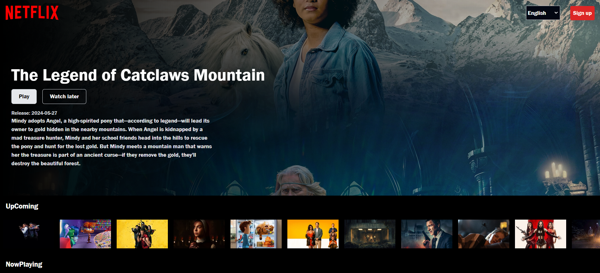

## Overview
This repository contains clone of a netflix site built using React.js for the frontend The application allows users to browse see movies, take favaourite movies , login acconnt.

## About Netflix Clone
- ** Project with Shimmer UI Effect, Search bar, Pagination Design in Tailwind CSS

## Tech Stack
### Frontend
- **React.js**: For building the user interface.
- **React Router Dom**: For navigation.
- **Axios/Fetch API**: For making HTTP requests.
- **React-Icons**: For All Icons show in site.

